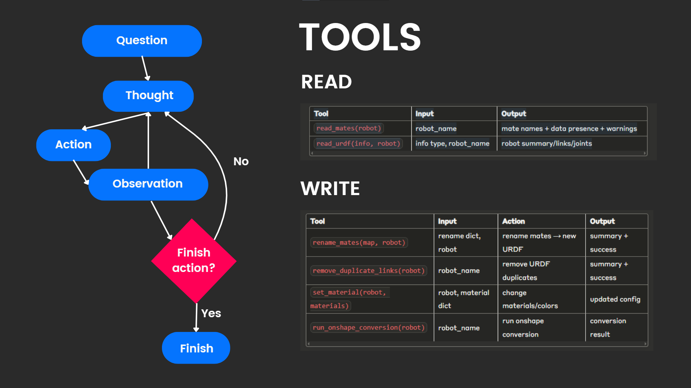

# CAD to Robot Backend

A FastAPI-based backend service that converts OnShape CAD assemblies into simulation-ready URDF (Unified Robot Description Format) files using an intelligent AI agent system.

## 🚀 Features

- **AI-Powered CAD Analysis**: Intelligent agent that analyzes and processes CAD assemblies
- **OnShape Integration**: Direct conversion from OnShape assemblies to URDF format
- **Real-time WebSocket Communication**: Live streaming of conversion progress and results
- **Interactive Tool Approval**: User control over file modifications with approval workflow
- **URDF Optimization**: Automatic duplicate link removal, mate renaming, and material assignment
- **File Upload Support**: ZIP file upload and processing capabilities
- **Dynamic Robot Support**: Works with any robot name/assembly (no hardcoded limitations)

## 🏗️ Architecture



### Core Components

#### 1. FastAPI Application (`app/main.py`)
- RESTful API endpoints for file uploads
- WebSocket endpoints for real-time communication
- CORS middleware for frontend integration
- Robot data management and file serving

#### 2. AI Agent System (`app/agent.py`)
- **CADtoURDFContext**: Maintains robot-specific conversion state
- **Dynamic Agent Creation**: Creates specialized agents for each robot
- **Streaming Response System**: Real-time progress updates
- **Tool Approval Workflow**: User-controlled modification system

#### 3. Augmented Tools (`app/augmented_tools/`)
- `run_onshape_conversion`: Core OnShape to URDF conversion
- `read_mates`: Analyze assembly mate relationships
- `read_urdf`: Parse and analyze URDF files
- `rename_mates`: Fix mate naming for proper joint recognition
- `remove_duplicate_links`: Clean up redundant URDF elements
- `set_material`: Apply visual materials to robot links

#### 4. WebSocket Management (`app/websockets.py`)
- Connection management for multiple clients
- Message broadcasting and personal messaging
- Real-time status updates

## 🛠️ Installation

### Prerequisites
- Python 3.8+
- pip package manager

### Setup

1. **Clone the repository**
```bash
git clone <repository-url>
cd cad-to-robot-backend
```

2. **Install dependencies**
```bash
uv lock
```

3. **Environment Configuration**
Create a `.env` file in the root directory:
```env
# Add your environment variables here
OPENAI_API_KEY=your_openai_api_key_here
```

4. **Create system prompt file**
Create `system_prompt.txt` in the root directory with your agent instructions.

## 🚀 Usage

### Starting the Server

```bash
# Development mode
uvicorn app.main:app --reload --host 0.0.0.0 --port 8000

# Production mode
uvicorn app.main:app --host 0.0.0.0 --port 8000
```

The server will be available at `http://localhost:8000`

### API Endpoints

#### File Upload
```http
POST /upload_robot
Content-Type: multipart/form-data

robot_zip: <ZIP file containing OnShape assembly data>
robot_name: <string identifier for the robot>
```

#### WebSocket Connection
```
ws://localhost:8000/ws/{client_id}
```

### WebSocket Message Format

#### Sending Messages
```json
{
  "content": "Convert my robot to URDF",
  "robot_name": "my-robot-name",
  "type": "message"
}
```

#### Tool Approval
```json
{
  "type": "tool_approval_response",
  "call_id": "tool_call_id",
  "approved": true
}
```

#### Receiving Responses
```json
{
  "type": "stream",
  "content": "Agent response text...",
  "timestamp": "2024-01-01T12:00:00",
  "sender": "assistant"
}
```

## 🤖 Agent Workflow

The AI agent follows a systematic approach to CAD-to-URDF conversion:

1. **Analysis Phase**
   - Read and analyze existing assembly mates
   - Identify joint structures and relationships
   - Check for common issues and compatibility

2. **Conversion Phase**
   - Run OnShape to URDF conversion
   - Handle conversion errors and retry with fixes
   - Generate initial URDF structure

3. **Optimization Phase**
   - Remove duplicate links and redundant elements
   - Rename mates for proper joint recognition (dof_ prefixes)
   - Apply appropriate materials for visualization
   - Validate final URDF structure

4. **Completion**
   - Provide comprehensive summary of changes
   - Deliver optimized, simulation-ready URDF file

## 🔧 Tool System

### Tool Access Levels
- **Read Tools**: Execute immediately (analysis operations)
- **Write Tools**: Require user approval (file modifications)

### Available Tools

| Tool | Purpose | Access Level |
|------|---------|--------------|
| `read_mates` | Analyze assembly mate relationships | Read |
| `read_urdf` | Parse and examine URDF files | Read |
| `run_onshape_conversion` | Convert OnShape assembly to URDF | Write |
| `rename_mates` | Fix mate naming conventions | Write |
| `remove_duplicate_links` | Clean up URDF duplicates | Write |
| `set_material` | Apply visual materials | Write |
| `set_multiple_materials` | Batch material application | Write |

## 📁 Project Structure

```
app/
├── main.py                 # FastAPI application and endpoints
├── agent.py               # AI agent system and context management
├── websockets.py          # WebSocket connection management
├── services/
│   └── run_onshape_to_robot.py  # Core conversion service
└── augmented_tools/       # AI agent tools
    ├── read_mates.py
    ├── read_urdf.py
    ├── rename_mates.py
    ├── remove_duplicate_links.py
    ├── set_material.py
    └── run_onshape_conversion.py
└── onshape/                # helper library for onshape conversion
└── data/                   # data folder 
```

## 🔄 Development Workflow

### Testing the Agent
```bash
# Test with specific robot
python -m app.agent my-robot-name

# Interactive mode
python -m app.agent
```

### Adding New Tools
1. Create tool function in `app/augmented_tools/`
2. Import and add to agent tools list in `app/agent.py`
3. Update tool access level in `get_tool_access_level()`
4. Add context update logic in `update_context_from_tool_result()`

## 📊 Status and Monitoring

The system provides real-time status updates including:
- Current robot being processed
- Active mate relationships
- Pending rename operations
- URDF issues and resolutions
- Conversion progress and completion

## 🔒 Security Features

- Tool approval workflow prevents unauthorized file modifications
- Client isolation with individual contexts and histories
- Request cancellation support for long-running operations
- Input validation and error handling

## 🤝 Contributing

1. Fork the repository
2. Create a feature branch
3. Make your changes
4. Add tests if applicable
5. Submit a pull request

## 📝 License

[Add your license information here]

## 🆘 Support

For issues and questions:
1. Check the console logs for detailed error messages
2. Verify your OnShape assembly data structure
3. Ensure proper mate naming conventions
4. Review the agent's step-by-step reasoning in the WebSocket stream

---

**Built with FastAPI, WebSockets, and AI-powered automation for seamless CAD-to-URDF conversion.**
